# Approach & Methodology

## Table of Contents
- [Development Model Selection](#development-model-selection)
- [Agile Implementation](#agile-implementation)
- [Sprint Planning & Execution](#sprint-planning--execution)
- [Continuous Integration/Continuous Deployment](#continuous-integrationcontinuous-deployment)
- [Quality Assurance Methodology](#quality-assurance-methodology)
- [Risk Management](#risk-management)
- [Team Collaboration](#team-collaboration)

## Development Model Selection

### Chosen Model: Agile Development with DevOps Integration

**Why Agile was Selected:**

✅ **Flexibility & Adaptability**
- Rapid prototyping and iterative development
- Quick response to changing requirements
- Continuous stakeholder feedback integration
- Ability to pivot based on user needs

✅ **Quality Focus**
- Test-driven development (TDD) approach
- Continuous integration and automated testing
- Regular code reviews and pair programming
- Quality gates at each sprint milestone

✅ **Collaboration & Communication**
- Cross-functional team collaboration
- Daily standups and sprint reviews
- Transparent progress tracking
- Stakeholder involvement throughout development

✅ **Time-to-Market Optimization**
- Working software delivered in short iterations
- MVP (Minimum Viable Product) approach
- Incremental feature delivery
- Reduced time between development and deployment

### Comparison with Other Models

| Model | Pros | Cons | Fit for AppCompatCheck |
|-------|------|------|----------------------|
| **Waterfall** | Clear phases, predictable timeline | Inflexible, late testing | ❌ Too rigid for complex platform |
| **Agile** | Flexible, continuous feedback | Requires discipline, scope creep risk | ✅ Perfect for iterative platform development |
| **DevOps** | Fast deployment, automation | Complex setup, tool dependencies | ✅ Essential for enterprise platform |
| **Lean** | Waste reduction, efficiency focus | May sacrifice documentation | ⚠️ Good principles, but need more structure |

## Agile Implementation

### Framework: Scrum with Kanban Elements

**Sprint Structure:**
- **Sprint Duration**: 2 weeks
- **Sprint Planning**: 4 hours every 2 weeks
- **Daily Standups**: 15 minutes daily
- **Sprint Review**: 2 hours end of sprint
- **Sprint Retrospective**: 1 hour post-review

### User Story Format
```
As a [type of user]
I want [functionality]
So that [business value/benefit]

Acceptance Criteria:
- Given [context]
- When [action]
- Then [outcome]

Definition of Done:
- [ ] Code implemented and reviewed
- [ ] Unit tests written and passing
- [ ] Integration tests passing
- [ ] Documentation updated
- [ ] Security review completed
- [ ] Performance benchmarks met
```

### Epic Breakdown for AppCompatCheck

#### Epic 1: Authentication & User Management
**User Stories:**
- As a developer, I want to register for an account so that I can access the platform
- As an organization admin, I want to manage team members so that I can control access
- As a user, I want secure login with MFA so that my account remains protected

#### Epic 2: Compatibility Analysis Engine
**User Stories:**
- As a developer, I want to scan my code for compatibility issues so that I can fix them early
- As a project manager, I want automated reports so that I can track project health
- As a team lead, I want custom rules so that I can enforce our coding standards

#### Epic 3: Real-time Monitoring Dashboard
**User Stories:**
- As a DevOps engineer, I want real-time alerts so that I can respond to issues quickly
- As a developer, I want to see live compatibility status so that I can monitor deployments
- As a manager, I want executive dashboards so that I can report to stakeholders

#### Epic 4: Integration Ecosystem
**User Stories:**
- As a developer, I want GitHub integration so that scans run on every commit
- As a project manager, I want Jira integration so that issues are automatically tracked
- As a team, we want Slack notifications so that everyone stays informed

## Sprint Planning & Execution

### Sprint 1: Foundation & Authentication (Week 1-2)
**Goals:**
- Set up development environment
- Implement basic authentication
- Create database schema
- Establish CI/CD pipeline

**Deliverables:**
- User registration and login
- JWT authentication system
- Database migrations
- Basic CI/CD workflow

**Acceptance Criteria:**
```
✅ Users can register with email/password
✅ JWT tokens are properly generated and validated
✅ Database schema supports multi-tenancy
✅ Automated tests run on every commit
```

### Sprint 2: Core Compatibility Engine (Week 3-4)
**Goals:**
- Implement scanning algorithms
- Create rule engine
- Build analysis pipeline
- Add basic reporting

**Deliverables:**
- Code scanning functionality
- Compatibility rule definitions
- Analysis result storage
- Basic report generation

### Sprint 3: Dashboard & Real-time Features (Week 5-6)
**Goals:**
- Build responsive dashboard
- Implement WebSocket connections
- Add real-time monitoring
- Create data visualizations

**Deliverables:**
- Interactive dashboard
- Live status updates
- Performance metrics display
- Real-time notifications

### Sprint 4: Integrations & Advanced Features (Week 7-8)
**Goals:**
- Integrate with GitHub/GitLab
- Add webhook support
- Implement advanced analytics
- Build admin interfaces

**Deliverables:**
- Repository integrations
- Webhook endpoints
- Advanced reporting
- Admin management tools

## Continuous Integration/Continuous Deployment

### CI/CD Pipeline Architecture

```mermaid
graph LR
    A[Developer Commit] --> B[GitHub Actions Trigger]
    B --> C[Lint & Type Check]
    C --> D[Unit Tests]
    D --> E[Integration Tests]
    E --> F[Build Application]
    F --> G[Security Scan]
    G --> H[Deploy to Staging]
    H --> I[E2E Tests]
    I --> J[Performance Tests]
    J --> K[Deploy to Production]
```



### Pipeline Stages

#### 1. Code Quality Gates
```yaml
# .github/workflows/ci.yml
name: Continuous Integration
on: [push, pull_request]

jobs:
  quality_gates:
    runs-on: ubuntu-latest
    steps:
      - name: Lint Code
        run: npm run lint
      - name: Type Check
        run: npm run type-check
      - name: Format Check
        run: npm run format:check
```

#### 2. Testing Strategy
```yaml
  test_suite:
    needs: quality_gates
    runs-on: ubuntu-latest
    steps:
      - name: Unit Tests
        run: npm run test:unit
      - name: Integration Tests
        run: npm run test:integration
      - name: Coverage Report
        run: npm run test:coverage
```

#### 3. Security & Performance
```yaml
  security_performance:
    needs: test_suite
    runs-on: ubuntu-latest
    steps:
      - name: Security Audit
        run: npm audit --audit-level moderate
      - name: Dependency Check
        run: npm run security:check
      - name: Performance Benchmark
        run: npm run test:performance
```

### Deployment Strategies

#### Blue-Green Deployment
- **Blue Environment**: Current production
- **Green Environment**: New version staging
- **Switch Strategy**: DNS/Load balancer flip
- **Rollback**: Immediate switch back to blue

#### Feature Flags
```typescript
// Feature flag implementation
const FeatureFlag = {
  AI_ANALYSIS: process.env.FEATURE_AI_ANALYSIS === 'true',
  ADVANCED_REPORTING: process.env.FEATURE_ADVANCED_REPORTING === 'true',
  REAL_TIME_MONITORING: process.env.FEATURE_REAL_TIME === 'true'
};

// Usage in components
if (FeatureFlag.AI_ANALYSIS) {
  return <AIAnalysisComponent />;
}
```

## Quality Assurance Methodology

### Testing Pyramid Strategy

#### 1. Unit Tests (70% of test suite)
**Tools**: Jest, React Testing Library
**Coverage Target**: 90%+
**Focus Areas**:
- Individual component behavior
- Utility function validation
- Business logic verification
- Error handling scenarios

```typescript
// Example unit test
describe('AuthService', () => {
  it('should generate valid JWT tokens', () => {
    const token = AuthService.generateToken({ userId: 1 });
    expect(AuthService.validateToken(token)).toBeTruthy();
  });
});
```

#### 2. Integration Tests (20% of test suite)
**Tools**: Playwright, Supertest
**Focus Areas**:
- API endpoint testing
- Database integration
- Third-party service mocking
- Component interaction

```typescript
// Example integration test
test('should create user and organization', async ({ request }) => {
  const response = await request.post('/api/auth/register', {
    data: { email: 'test@example.com', password: 'secure123' }
  });
  expect(response.ok()).toBeTruthy();
});
```

#### 3. End-to-End Tests (10% of test suite)
**Tools**: Playwright, Cypress
**Focus Areas**:
- Complete user workflows
- Cross-browser compatibility
- Performance validation
- Accessibility compliance

```typescript
// Example E2E test
test('complete compatibility scan workflow', async ({ page }) => {
  await page.goto('/dashboard');
  await page.click('[data-testid="start-scan"]');
  await page.waitForSelector('[data-testid="scan-results"]');
  expect(page.locator('[data-testid="compatibility-score"]')).toBeVisible();
});
```

### Code Quality Standards

#### ESLint Configuration
```json
{
  "extends": [
    "next/core-web-vitals",
    "@typescript-eslint/recommended",
    "prettier"
  ],
  "rules": {
    "complexity": ["error", 10],
    "max-lines-per-function": ["error", 50],
    "no-console": "warn",
    "@typescript-eslint/no-any": "error"
  }
}
```

#### Code Review Checklist
- [ ] **Functionality**: Does the code work as intended?
- [ ] **Performance**: Are there any performance bottlenecks?
- [ ] **Security**: Are there security vulnerabilities?
- [ ] **Maintainability**: Is the code readable and maintainable?
- [ ] **Testing**: Are appropriate tests included?
- [ ] **Documentation**: Is the code properly documented?

## Risk Management

### Risk Assessment Matrix

| Risk | Probability | Impact | Mitigation Strategy |
|------|-------------|---------|-------------------|
| **Third-party API Changes** | Medium | High | Version pinning, fallback strategies, monitoring |
| **Database Performance** | Low | High | Query optimization, indexing, caching layer |
| **Security Vulnerabilities** | Medium | Critical | Regular audits, automated scanning, security reviews |
| **Scalability Issues** | Medium | Medium | Load testing, horizontal scaling, monitoring |
| **Team Knowledge Gaps** | Low | Medium | Documentation, pair programming, knowledge sharing |

### Mitigation Strategies

#### Technical Risks
- **Backup and Recovery**: Automated daily backups with 30-day retention
- **Monitoring**: 24/7 system monitoring with alert thresholds
- **Redundancy**: Multi-zone deployment with failover capabilities
- **Security**: Regular penetration testing and vulnerability assessments

#### Process Risks
- **Scope Creep**: Strict change control process and stakeholder approval
- **Timeline Delays**: Buffer time allocation and priority-based feature cutting
- **Quality Issues**: Comprehensive testing strategy and quality gates
- **Communication Gaps**: Daily standups and weekly stakeholder updates

## Team Collaboration

### Communication Framework

#### Daily Standups (15 minutes)
**Format:**
- What did I accomplish yesterday?
- What will I work on today?
- What obstacles are impeding my progress?

#### Sprint Planning (4 hours every 2 weeks)
**Agenda:**
1. Review previous sprint outcomes
2. Estimate new user stories
3. Commit to sprint backlog
4. Identify dependencies and risks

#### Sprint Review & Demo (2 hours end of sprint)
**Participants**: Development team + stakeholders
**Content:**
- Demonstrate completed features
- Review sprint metrics
- Gather feedback for next iteration

#### Sprint Retrospective (1 hour post-review)
**Format**: Start-Stop-Continue framework
- What should we start doing?
- What should we stop doing?
- What should we continue doing?

### Collaboration Tools

#### Development Tools
- **Version Control**: Git with feature branch workflow
- **Code Review**: GitHub Pull Requests with required approvals
- **Project Management**: GitHub Projects with automated boards
- **Documentation**: Markdown in repository + Notion for specifications

#### Communication Tools
- **Daily Communication**: Slack with dedicated channels
- **Video Meetings**: Zoom for sprint ceremonies
- **Async Updates**: Loom for feature demonstrations
- **Issue Tracking**: GitHub Issues with templates and labels

### Knowledge Management

#### Documentation Standards
- **Code Documentation**: JSDoc comments for all public APIs
- **Architecture Decisions**: ADR (Architecture Decision Records)
- **Process Documentation**: Runbooks for common procedures
- **User Guides**: Comprehensive end-user documentation

#### Knowledge Sharing Sessions
- **Weekly Tech Talks**: Team members present new technologies
- **Monthly Architecture Reviews**: Deep dive into system design
- **Quarterly Retrospectives**: High-level process improvements
- **Annual Planning**: Strategic direction and technology roadmap

---

*This methodology has been successfully applied throughout the AppCompatCheck project development, resulting in a robust, scalable, and maintainable enterprise platform delivered on schedule with high quality standards.*