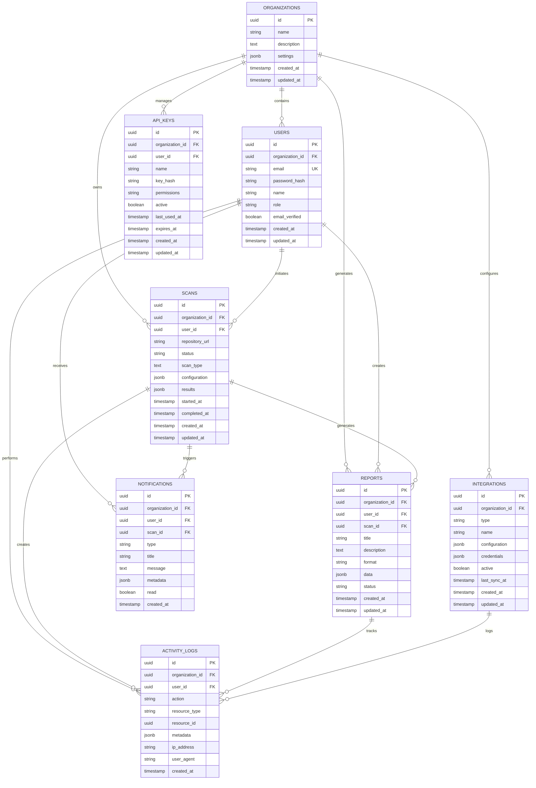
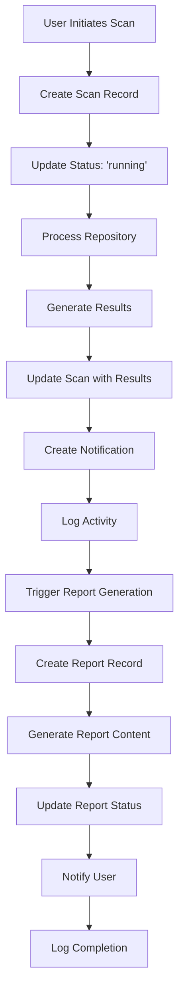
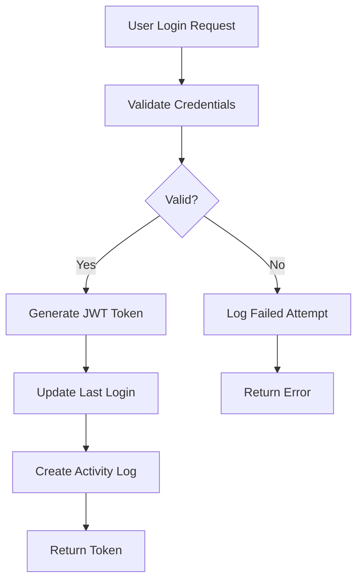
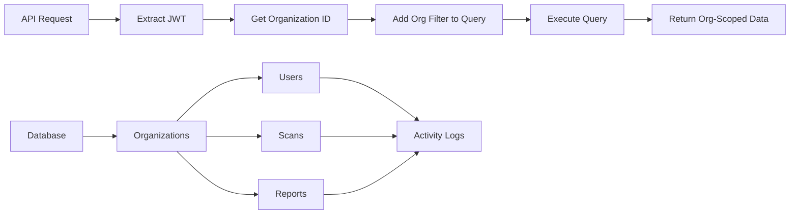
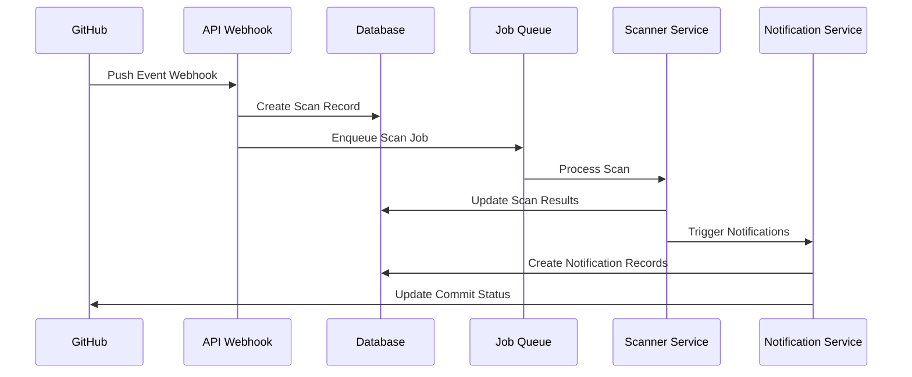

# Entity Relationship Diagrams

## Table of Contents
- [Database Overview](#database-overview)
- [Entity Relationships](#entity-relationships)
- [Core Entities](#core-entities)
- [Entity Details](#entity-details)
- [Relationship Types](#relationship-types)
- [Database Constraints](#database-constraints)
- [Indexing Strategy](#indexing-strategy)
- [Data Flow Diagrams](#data-flow-diagrams)

## Database Overview

The AppCompatCheck database is designed with a multi-tenant architecture that supports organizations, users, compatibility scans, and comprehensive reporting. The schema follows normalization principles while maintaining performance through strategic denormalization where needed.

### Key Design Principles
- **Multi-tenant Architecture**: Data isolation per organization
- **Audit Trail**: Comprehensive activity logging
- **Scalability**: Optimized for high-volume scanning operations
- **Data Integrity**: Foreign key constraints and validation
- **Performance**: Strategic indexing and query optimization

## Entity Relationships

### High-Level ERD


## Core Entities

### 1. Organizations
**Purpose**: Multi-tenant container for all resources
**Key Relationships**: One-to-many with Users, Scans, Reports

```sql
CREATE TABLE organizations (
    id UUID PRIMARY KEY DEFAULT gen_random_uuid(),
    name TEXT NOT NULL,
    description TEXT,
    settings JSONB DEFAULT '{}',
    created_at TIMESTAMP DEFAULT NOW(),
    updated_at TIMESTAMP DEFAULT NOW()
);

-- Settings structure example:
{
    "maxScansPerMonth": 100,
    "allowPublicReports": false,
    "defaultScanConfiguration": {
        "includeDeprecated": true,
        "checkSecurity": true
    },
    "branding": {
        "logo": "https://example.com/logo.png",
        "primaryColor": "#3B82F6"
    }
}
```

### 2. Users
**Purpose**: Authentication and authorization
**Key Relationships**: Belongs to Organization, initiates Scans and Reports

```sql
CREATE TABLE users (
    id UUID PRIMARY KEY DEFAULT gen_random_uuid(),
    organization_id UUID REFERENCES organizations(id) ON DELETE CASCADE,
    email TEXT NOT NULL UNIQUE,
    password_hash TEXT NOT NULL,
    name TEXT NOT NULL,
    role TEXT NOT NULL DEFAULT 'user',
    email_verified BOOLEAN DEFAULT FALSE,
    created_at TIMESTAMP DEFAULT NOW(),
    updated_at TIMESTAMP DEFAULT NOW()
);

-- Role-based permissions:
-- 'admin': Full organization access
-- 'manager': Can manage scans and reports
-- 'developer': Can create scans and view reports
-- 'viewer': Read-only access
```

### 3. Scans
**Purpose**: Core compatibility analysis operations
**Key Relationships**: Belongs to Organization and User, generates Reports

```sql
CREATE TABLE scans (
    id UUID PRIMARY KEY DEFAULT gen_random_uuid(),
    organization_id UUID REFERENCES organizations(id) ON DELETE CASCADE,
    user_id UUID REFERENCES users(id) ON DELETE SET NULL,
    repository_url TEXT NOT NULL,
    status TEXT NOT NULL DEFAULT 'pending',
    scan_type TEXT NOT NULL DEFAULT 'full',
    configuration JSONB DEFAULT '{}',
    results JSONB,
    started_at TIMESTAMP,
    completed_at TIMESTAMP,
    created_at TIMESTAMP DEFAULT NOW(),
    updated_at TIMESTAMP DEFAULT NOW()
);

-- Status values: 'pending', 'running', 'completed', 'failed', 'cancelled'
-- Scan types: 'full', 'incremental', 'security', 'dependencies'

-- Configuration example:
{
    "includeDeprecated": true,
    "checkSecurity": true,
    "frameworks": ["react", "nextjs"],
    "targetVersions": {
        "node": ">=18.0.0",
        "react": ">=18.0.0"
    },
    "excludePatterns": ["node_modules/**", "dist/**"]
}

-- Results example:
{
    "summary": {
        "totalIssues": 15,
        "criticalIssues": 2,
        "warningIssues": 8,
        "infoIssues": 5
    },
    "issues": [
        {
            "type": "compatibility",
            "severity": "critical",
            "file": "src/components/Button.tsx",
            "line": 25,
            "message": "React 19 breaking change detected",
            "suggestion": "Update prop usage to new API"
        }
    ],
    "metrics": {
        "scanDuration": 45000,
        "filesScanned": 150,
        "dependenciesAnalyzed": 85
    }
}
```

## Entity Details

### 4. Reports
**Purpose**: Generated documentation and analysis summaries
**Key Relationships**: Belongs to Organization, User, and Scan

```sql
CREATE TABLE reports (
    id UUID PRIMARY KEY DEFAULT gen_random_uuid(),
    organization_id UUID REFERENCES organizations(id) ON DELETE CASCADE,
    user_id UUID REFERENCES users(id) ON DELETE SET NULL,
    scan_id UUID REFERENCES scans(id) ON DELETE CASCADE,
    title TEXT NOT NULL,
    description TEXT,
    format TEXT NOT NULL DEFAULT 'html',
    data JSONB,
    status TEXT NOT NULL DEFAULT 'generating',
    created_at TIMESTAMP DEFAULT NOW(),
    updated_at TIMESTAMP DEFAULT NOW()
);

-- Format options: 'html', 'pdf', 'json', 'csv'
-- Status values: 'generating', 'completed', 'failed'

-- Report data structure:
{
    "template": "comprehensive",
    "sections": {
        "executiveSummary": true,
        "detailedFindings": true,
        "recommendations": true,
        "metrics": true
    },
    "filters": {
        "severity": ["critical", "high"],
        "categories": ["compatibility", "security"]
    },
    "metadata": {
        "generatedAt": "2024-01-15T10:30:00Z",
        "version": "1.0"
    }
}
```

### 5. Notifications
**Purpose**: User alerts and system communications
**Key Relationships**: Belongs to Organization and User, optionally linked to Scan

```sql
CREATE TABLE notifications (
    id UUID PRIMARY KEY DEFAULT gen_random_uuid(),
    organization_id UUID REFERENCES organizations(id) ON DELETE CASCADE,
    user_id UUID REFERENCES users(id) ON DELETE CASCADE,
    scan_id UUID REFERENCES scans(id) ON DELETE SET NULL,
    type TEXT NOT NULL,
    title TEXT NOT NULL,
    message TEXT,
    metadata JSONB DEFAULT '{}',
    read BOOLEAN DEFAULT FALSE,
    created_at TIMESTAMP DEFAULT NOW()
);

-- Notification types:
-- 'scan_completed', 'scan_failed', 'report_ready', 'system_alert', 'integration_error'

-- Metadata example:
{
    "priority": "high",
    "actionRequired": true,
    "relatedResources": [
        {"type": "scan", "id": "uuid"},
        {"type": "report", "id": "uuid"}
    ],
    "channels": ["email", "in_app", "slack"]
}
```

### 6. Activity Logs
**Purpose**: Comprehensive audit trail
**Key Relationships**: Links to Organization, User, and any resource

```sql
CREATE TABLE activity_logs (
    id UUID PRIMARY KEY DEFAULT gen_random_uuid(),
    organization_id UUID REFERENCES organizations(id) ON DELETE CASCADE,
    user_id UUID REFERENCES users(id) ON DELETE SET NULL,
    action TEXT NOT NULL,
    resource_type TEXT,
    resource_id UUID,
    metadata JSONB DEFAULT '{}',
    ip_address INET,
    user_agent TEXT,
    created_at TIMESTAMP DEFAULT NOW()
);

-- Action examples:
-- 'scan.created', 'scan.started', 'scan.completed', 'report.generated',
-- 'user.login', 'user.logout', 'settings.updated', 'integration.configured'

-- Metadata example:
{
    "previousValues": {
        "name": "Old Organization Name"
    },
    "newValues": {
        "name": "New Organization Name"
    },
    "context": {
        "source": "web_ui",
        "sessionId": "session_uuid"
    }
}
```

### 7. API Keys
**Purpose**: Programmatic access authentication
**Key Relationships**: Belongs to Organization and User

```sql
CREATE TABLE api_keys (
    id UUID PRIMARY KEY DEFAULT gen_random_uuid(),
    organization_id UUID REFERENCES organizations(id) ON DELETE CASCADE,
    user_id UUID REFERENCES users(id) ON DELETE CASCADE,
    name TEXT NOT NULL,
    key_hash TEXT NOT NULL,
    permissions TEXT NOT NULL DEFAULT 'read',
    active BOOLEAN DEFAULT TRUE,
    last_used_at TIMESTAMP,
    expires_at TIMESTAMP,
    created_at TIMESTAMP DEFAULT NOW(),
    updated_at TIMESTAMP DEFAULT NOW()
);

-- Permissions: 'read', 'write', 'admin'
-- Key format: 'acc_' + 32 random characters
```

### 8. Integrations
**Purpose**: Third-party service connections
**Key Relationships**: Belongs to Organization

```sql
CREATE TABLE integrations (
    id UUID PRIMARY KEY DEFAULT gen_random_uuid(),
    organization_id UUID REFERENCES organizations(id) ON DELETE CASCADE,
    type TEXT NOT NULL,
    name TEXT NOT NULL,
    configuration JSONB DEFAULT '{}',
    credentials JSONB DEFAULT '{}',
    active BOOLEAN DEFAULT TRUE,
    last_sync_at TIMESTAMP,
    created_at TIMESTAMP DEFAULT NOW(),
    updated_at TIMESTAMP DEFAULT NOW()
);

-- Integration types: 'github', 'gitlab', 'bitbucket', 'jira', 'slack', 'teams'

-- Configuration examples:
-- GitHub:
{
    "webhookUrl": "https://api.github.com/repos/user/repo/hooks",
    "events": ["push", "pull_request"],
    "autoScan": true
}

-- Slack:
{
    "channel": "#development",
    "notifyOnScanComplete": true,
    "notifyOnCriticalIssues": true
}
```

## Relationship Types

### One-to-Many Relationships

#### Organizations → Users
- **Cardinality**: One organization can have many users
- **Constraint**: Users must belong to exactly one organization
- **Business Rule**: Users cannot exist without an organization

#### Organizations → Scans
- **Cardinality**: One organization can have many scans
- **Constraint**: Scans must belong to exactly one organization
- **Business Rule**: Scan data is isolated per organization

#### Users → Scans
- **Cardinality**: One user can initiate many scans
- **Constraint**: Scans can exist without a user (if user is deleted)
- **Business Rule**: User deletion sets scan.user_id to NULL

#### Scans → Reports
- **Cardinality**: One scan can generate many reports
- **Constraint**: Reports must be linked to exactly one scan
- **Business Rule**: Report deletion when scan is deleted (CASCADE)

### Optional Relationships

#### Notifications → Scans
- **Cardinality**: Many notifications can optionally reference one scan
- **Constraint**: Notifications can exist without scan reference
- **Business Rule**: System notifications may not be scan-related

### Polymorphic Relationships

#### Activity Logs → Resources
- **Pattern**: Generic foreign key with type field
- **Fields**: `resource_type` + `resource_id`
- **Supports**: Any entity type can be logged

## Database Constraints

### Primary Keys
```sql
-- All tables use UUID primary keys for global uniqueness
id UUID PRIMARY KEY DEFAULT gen_random_uuid()
```

### Foreign Key Constraints
```sql
-- Cascade deletion for organization data isolation
organization_id UUID REFERENCES organizations(id) ON DELETE CASCADE

-- Preserve audit trail when users are deleted
user_id UUID REFERENCES users(id) ON DELETE SET NULL

-- Maintain referential integrity for core relationships
scan_id UUID REFERENCES scans(id) ON DELETE CASCADE
```

### Unique Constraints
```sql
-- Ensure unique user emails across the system
ALTER TABLE users ADD CONSTRAINT users_email_unique UNIQUE (email);

-- Unique API key names per organization
ALTER TABLE api_keys ADD CONSTRAINT api_keys_org_name_unique 
    UNIQUE (organization_id, name);

-- Unique integration type per organization
ALTER TABLE integrations ADD CONSTRAINT integrations_org_type_unique 
    UNIQUE (organization_id, type);
```

### Check Constraints
```sql
-- Valid user roles
ALTER TABLE users ADD CONSTRAINT users_role_check 
    CHECK (role IN ('admin', 'manager', 'developer', 'viewer'));

-- Valid scan statuses
ALTER TABLE scans ADD CONSTRAINT scans_status_check 
    CHECK (status IN ('pending', 'running', 'completed', 'failed', 'cancelled'));

-- Valid notification types
ALTER TABLE notifications ADD CONSTRAINT notifications_type_check 
    CHECK (type IN ('scan_completed', 'scan_failed', 'report_ready', 
                   'system_alert', 'integration_error'));
```

## Indexing Strategy

### Performance Indexes
```sql
-- Organizations
CREATE INDEX idx_organizations_created_at ON organizations(created_at);

-- Users - frequently queried fields
CREATE INDEX idx_users_organization_id ON users(organization_id);
CREATE INDEX idx_users_email ON users(email); -- Unique constraint creates this
CREATE INDEX idx_users_role ON users(role);

-- Scans - high-volume queries
CREATE INDEX idx_scans_organization_id ON scans(organization_id);
CREATE INDEX idx_scans_user_id ON scans(user_id);
CREATE INDEX idx_scans_status ON scans(status);
CREATE INDEX idx_scans_created_at ON scans(created_at);
CREATE INDEX idx_scans_org_created ON scans(organization_id, created_at);

-- Reports - document retrieval
CREATE INDEX idx_reports_organization_id ON reports(organization_id);
CREATE INDEX idx_reports_scan_id ON reports(scan_id);
CREATE INDEX idx_reports_status ON reports(status);
CREATE INDEX idx_reports_format ON reports(format);

-- Notifications - real-time queries
CREATE INDEX idx_notifications_user_id ON notifications(user_id);
CREATE INDEX idx_notifications_read ON notifications(read);
CREATE INDEX idx_notifications_created_at ON notifications(created_at);
CREATE INDEX idx_notifications_user_unread ON notifications(user_id, read) 
    WHERE read = false;

-- Activity Logs - audit queries
CREATE INDEX idx_activity_logs_organization_id ON activity_logs(organization_id);
CREATE INDEX idx_activity_logs_user_id ON activity_logs(user_id);
CREATE INDEX idx_activity_logs_action ON activity_logs(action);
CREATE INDEX idx_activity_logs_created_at ON activity_logs(created_at);
CREATE INDEX idx_activity_logs_resource ON activity_logs(resource_type, resource_id);

-- API Keys - authentication
CREATE INDEX idx_api_keys_organization_id ON api_keys(organization_id);
CREATE INDEX idx_api_keys_active ON api_keys(active);
CREATE INDEX idx_api_keys_expires_at ON api_keys(expires_at);

-- Integrations - configuration queries
CREATE INDEX idx_integrations_organization_id ON integrations(organization_id);
CREATE INDEX idx_integrations_type ON integrations(type);
CREATE INDEX idx_integrations_active ON integrations(active);
```

### Composite Indexes
```sql
-- Multi-column indexes for complex queries
CREATE INDEX idx_scans_org_status_created ON scans(organization_id, status, created_at);
CREATE INDEX idx_reports_org_scan_created ON reports(organization_id, scan_id, created_at);
CREATE INDEX idx_notifications_user_type_read ON notifications(user_id, type, read);
```

### JSONB Indexes
```sql
-- GIN indexes for JSONB columns
CREATE INDEX idx_scans_results_gin ON scans USING gin(results);
CREATE INDEX idx_reports_data_gin ON reports USING gin(data);
CREATE INDEX idx_organizations_settings_gin ON organizations USING gin(settings);

-- Specific JSONB path indexes
CREATE INDEX idx_scans_status_summary ON scans USING gin((results->'summary'));
CREATE INDEX idx_integrations_config_type ON integrations USING gin((configuration->'type'));
```

## Data Flow Diagrams

### Scan Lifecycle Data Flow


### User Authentication Flow


### Multi-tenant Data Isolation


### Integration Event Flow


---

*This comprehensive ERD documentation provides the foundation for understanding the AppCompatCheck database architecture, ensuring data consistency, and supporting scalable multi-tenant operations.*


*Note: Visual ERD diagram is available in the assets folder*