# System Architecture Diagrams

## Table of Contents
- [High-Level System Architecture](#high-level-system-architecture)
- [Application Architecture](#application-architecture)
- [Database Architecture](#database-architecture)
- [Infrastructure Architecture](#infrastructure-architecture)
- [Security Architecture](#security-architecture)
- [Integration Architecture](#integration-architecture)
- [Deployment Architecture](#deployment-architecture)
- [Scalability Architecture](#scalability-architecture)

## High-Level System Architecture

### Overview
The AppCompatCheck platform follows a modern, cloud-native architecture designed for scalability, maintainability, and security. The system is built using a microservices-inspired approach with clear separation of concerns.

### System Architecture Diagram
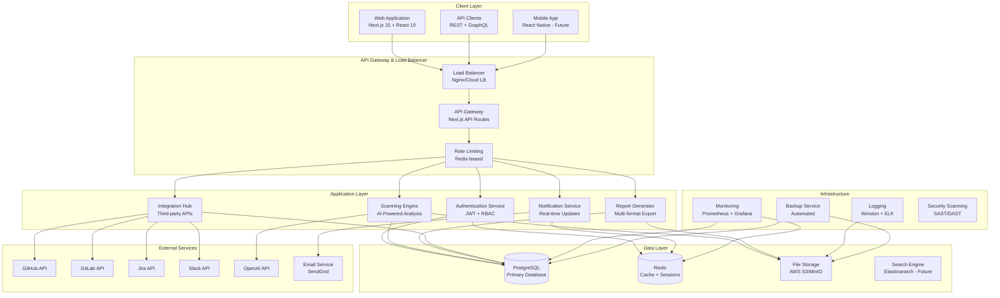

## Application Architecture

### Next.js Application Structure
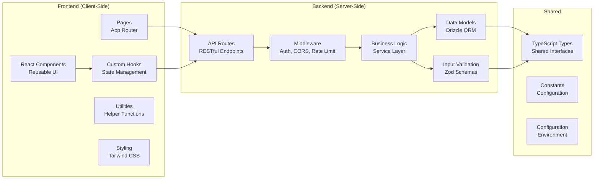

### Component Architecture
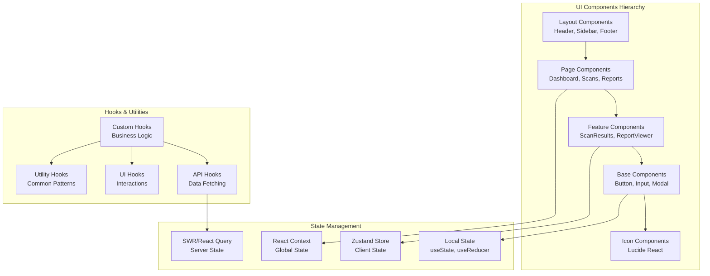

## Database Architecture

### Database Schema Architecture
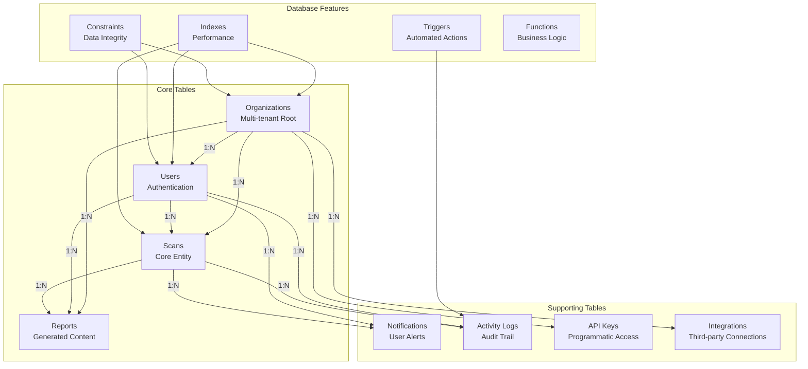

### Data Flow Architecture
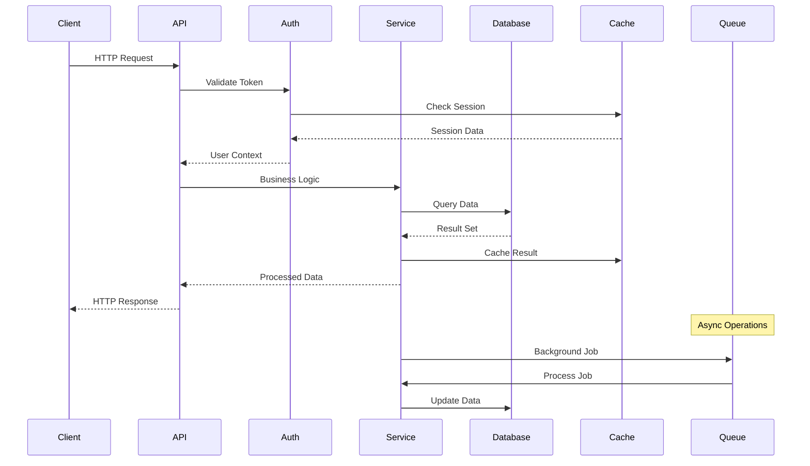

## Infrastructure Architecture

### Cloud Infrastructure (Production)
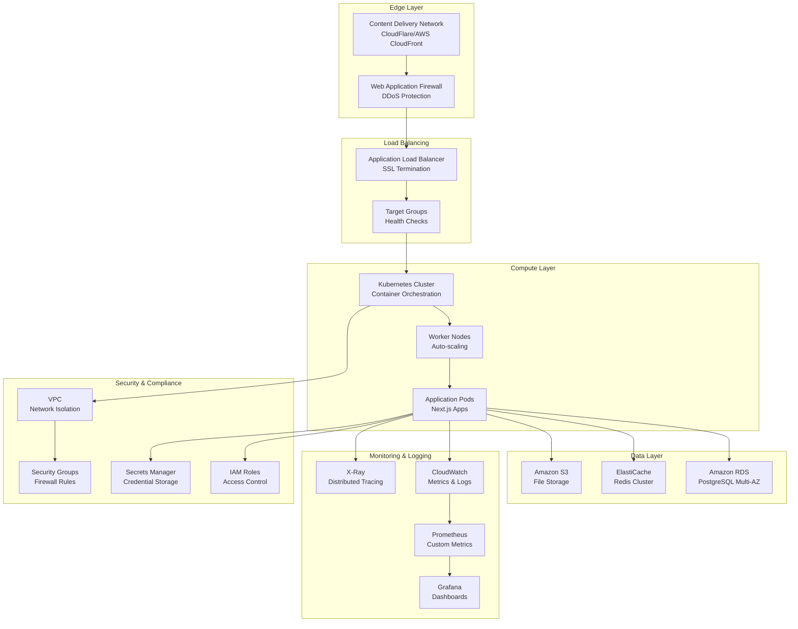

### Container Architecture
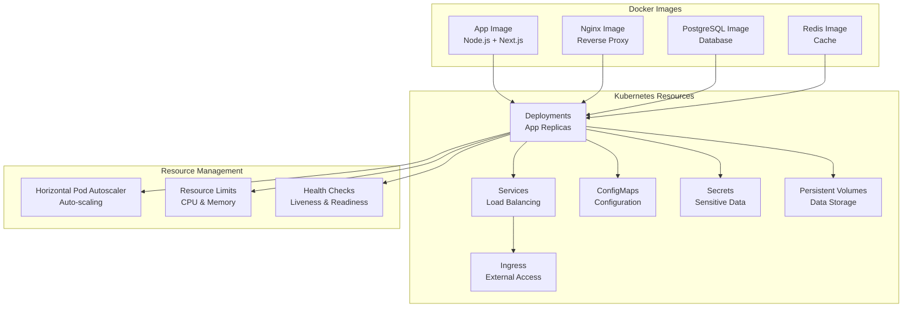

## Security Architecture

### Authentication & Authorization Flow
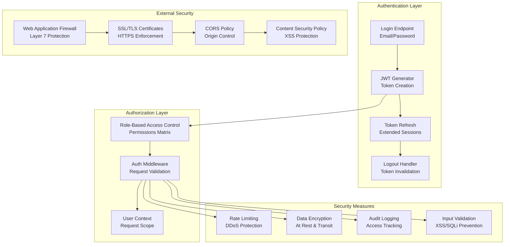

### Data Security Architecture
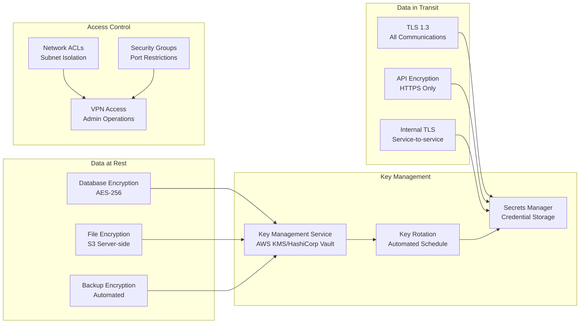

## Integration Architecture

### Third-Party Integrations
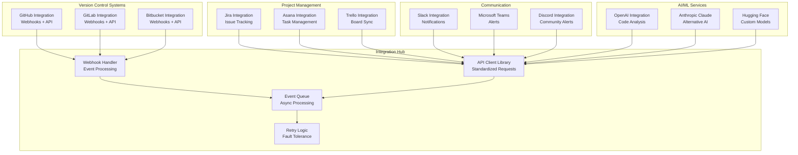

### API Integration Patterns
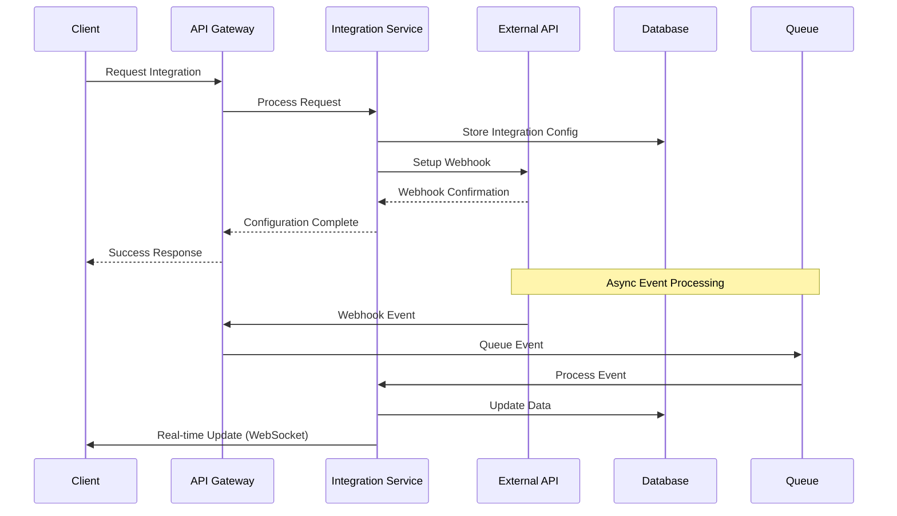

## Deployment Architecture

### Multi-Environment Deployment
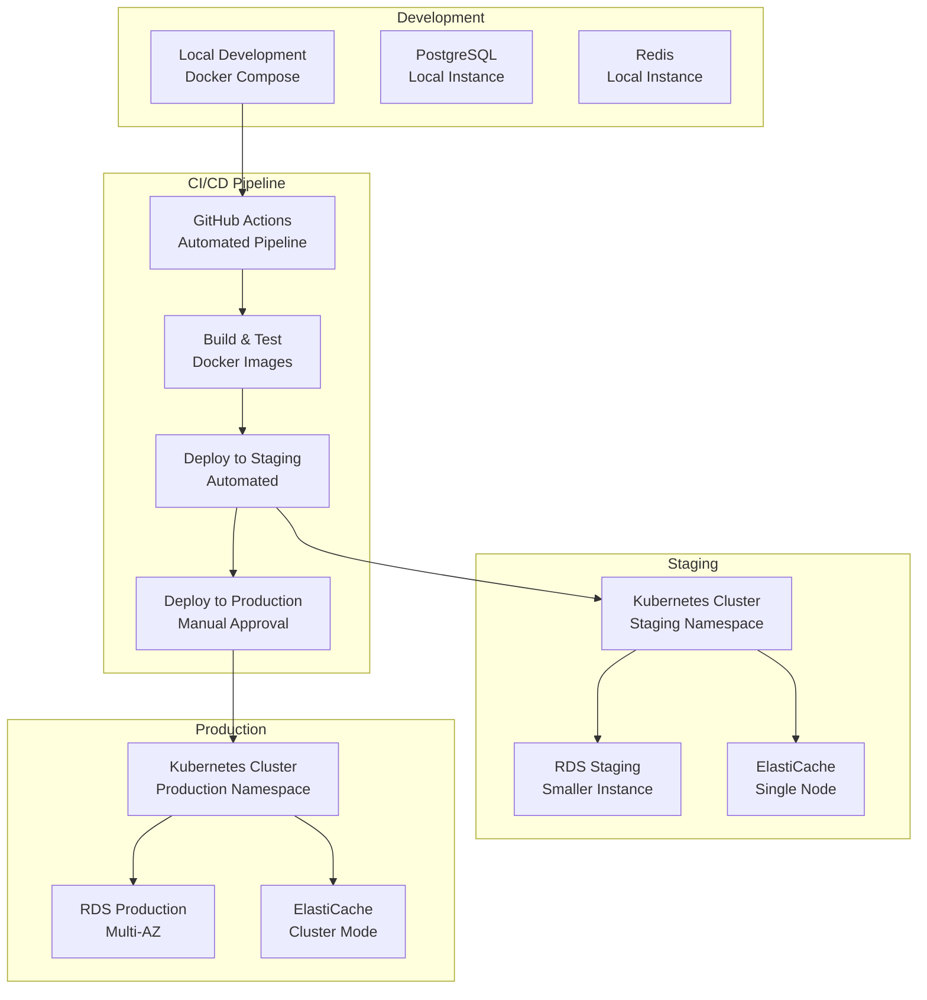

### Blue-Green Deployment Strategy
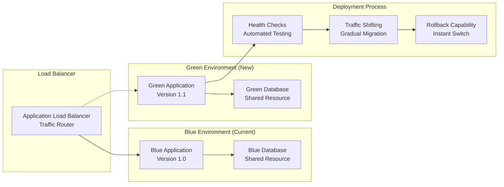

## Scalability Architecture

### Horizontal Scaling Strategy
```mermaid
graph TB
    subgraph "Application Scaling"
        HPA[Horizontal Pod Autoscaler<br/>CPU/Memory Based]
        REPLICAS[Pod Replicas<br/>2-10 Instances]
        LOAD_BALANCER[Service Load Balancer<br/>Traffic Distribution]
    end

    subgraph "Database Scaling"
        READ_REPLICAS[Read Replicas<br/>Query Distribution]
        CONNECTION_POOL[Connection Pooling<br/>PgBouncer]
        QUERY_CACHE[Query Caching<br/>Redis Layer]
    end

    subgraph "Cache Scaling"
        REDIS_CLUSTER[Redis Cluster<br/>Distributed Cache]
        CACHE_LAYERS[Multi-layer Caching<br/>L1/L2 Strategy]
        CDN_CACHE[CDN Caching<br/>Static Assets]
    end

    subgraph "Queue Scaling"
        QUEUE_WORKERS[Worker Processes<br/>Background Jobs]
        QUEUE_CLUSTER[Queue Clustering<br/>Redis/SQS]
        PRIORITY_QUEUES[Priority Queues<br/>Job Classification]
    end

    HPA --> REPLICAS
    REPLICAS --> LOAD_BALANCER

    READ_REPLICAS --> CONNECTION_POOL
    CONNECTION_POOL --> QUERY_CACHE

    REDIS_CLUSTER --> CACHE_LAYERS
    CACHE_LAYERS --> CDN_CACHE

    QUEUE_WORKERS --> QUEUE_CLUSTER
    QUEUE_CLUSTER --> PRIORITY_QUEUES
```

### Performance Optimization Architecture
```mermaid
graph TB
    subgraph "Frontend Optimization"
        CODE_SPLIT[Code Splitting<br/>Dynamic Imports]
        LAZY_LOAD[Lazy Loading<br/>Component Loading]
        IMAGE_OPT[Image Optimization<br/>Next.js Optimization]
        BUNDLE_OPT[Bundle Optimization<br/>Tree Shaking]
    end

    subgraph "Backend Optimization"
        API_CACHE[API Response Caching<br/>Redis TTL]
        DB_INDEX[Database Indexing<br/>Query Optimization]
        COMPRESSION[Response Compression<br/>Gzip/Brotli]
        PAGINATION[Data Pagination<br/>Cursor-based]
    end

    subgraph "Infrastructure Optimization"
        AUTO_SCALE[Auto-scaling<br/>Resource Adaptation]
        RESOURCE_LIMITS[Resource Limits<br/>Container Constraints]
        HEALTH_MONITORING[Health Monitoring<br/>Proactive Scaling]
    end

    CODE_SPLIT --> LAZY_LOAD
    LAZY_LOAD --> IMAGE_OPT
    IMAGE_OPT --> BUNDLE_OPT

    API_CACHE --> DB_INDEX
    DB_INDEX --> COMPRESSION
    COMPRESSION --> PAGINATION

    AUTO_SCALE --> RESOURCE_LIMITS
    RESOURCE_LIMITS --> HEALTH_MONITORING
```

### Monitoring & Observability Architecture
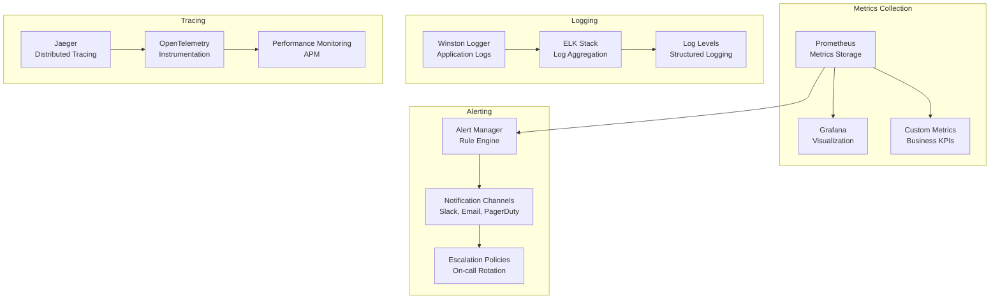

---

*This comprehensive system architecture documentation provides a complete view of the AppCompatCheck platform's technical design, from high-level system components to detailed deployment and scaling strategies.*

*Note: Visual architecture diagrams are available in the assets folder*